## 👨‍💻 Sobre Mim

Atualmente sou **Analista de Machine Learning** na **Concessionária Nova Rota do Oeste**, onde desenvolvo soluções de IA aplicadas à segurança e eficiência operacional em rodovias. Minha conhecimento vai desde o desenvolvimento de modelos de **Visão Computacional** até implementação de **Large Language Models (LLMs)** para análise de dados e documentos (como: PDFs, CSVs, SQL, etc).

---

### 💻 Computer Vision

### LLM Stack

### Data Science & Visualization

### MLOps & Backend

### 🗄️ Languages & Tools

## 🎓 Áreas de Especialização

```mermaid
---
config:
  theme: base
  themeVariables:
    fontFamily: Roboto, sans-serif&quot;
    fontSize: &quot;18px&quot;
    primaryColor: &quot;#d8bbff&quot;       # Roxo Neon Suave (Raiz)
    primaryTextColor: &quot;#121212&quot;   # Texto quase preto para alto contraste
    primaryBorderColor: &quot;#d8bbff&quot; # Borda igual ao fundo para efeito &quot;glow&quot;
    secondaryColor: &quot;#90e0ef&quot;     # Ciano/Azul Elétrico Suave (Nível 2)
    secondaryTextColor: &quot;#121212&quot; # Texto quase preto
    secondaryBorderColor: &quot;#90e0ef&quot;
    tertiaryColor: &quot;#a0c4ff&quot;      # Azul Tecnológico Suave (Nível 3)
    tertiaryTextColor: &quot;#121212&quot;  # Texto quase preto
    lineColor: &quot;#8e9edb&quot;          # Linhas de conexão em azul/roxo brilhante
    textColor: &quot;#c9d1d9&quot;          # Cor de texto de fallback (para o tema escuro)
    background: &quot;transparent&quot;     # Fundo transparente para se integrar ao GitHub
---
mindmap
  root((🤖 Machine Learning\nEngineer))
    👁️ Computer Vision
      🎯 Object Detection
      🖼️ Image Classification
      ✂️ Segmentation
      🚁 Drone Vision
    🧠 Deep Learning
      🔥 PyTorch
      🌊 TensorFlow
      🕸️ Neural Networks
      🔄 Transfer Learning
    🦙 LLMs & NLP
      📚 RAG Systems
      💻 Local LLMs
      👥 Multi-Agent
      🔍 Embeddings
    ⚙️ MLOps
      🐳 Docker
      🔄 CI/CD
      🚀 Model Serving
      📊 Monitoring
```

---

## 🌱 Aprendendo Atualmente

- 🚁 **Visão Computacional aplicada a drones** para agricultura de precisão
- 🧠 **Fine-tuning de LLMs** para domínios específicos
- ⚡ **Edge AI** e otimização de modelos para dispositivos embarcados
- 📊 **MLOps avançado** com Kubernetes e Grafana
- 🔬 **Técnicas state-of-the-art** em Computer Vision

---

**Princípios:**
- 🎯 Foco em problemas reais e impacto mensurável
- 🔒 Privacidade e controle total da stack (modelos locais)
- 📚 Pesquisa aplicada com base científica sólida
- 🏗️ Arquitetura limpa e código manutenível
- 🔄 Iteração rápida com validação rigorosa

